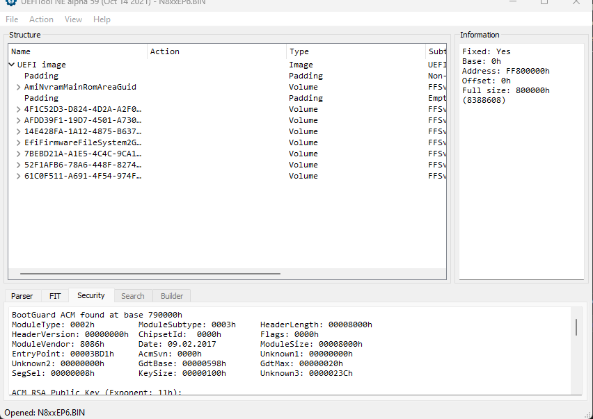
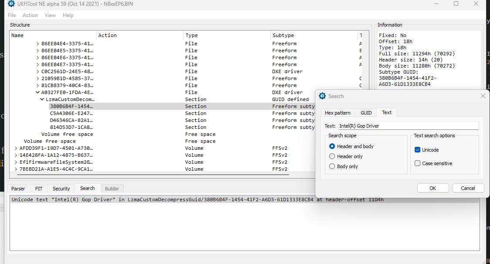
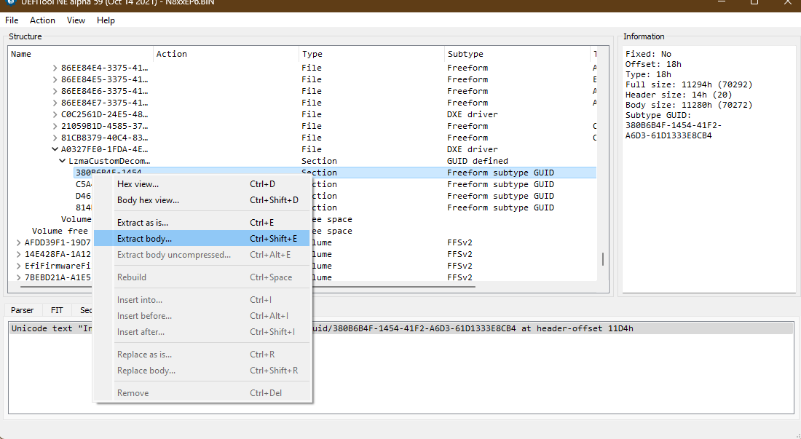

+++
title = 'Intel iGPU Passthrough for OVMF'
date = 2023-10-11
Lastmod = 2025-01-27

summary = "A guide to Intel iGPU Passthrough on Proxmox/KVM that discusses how to compile your own vBIOS and setup your VM"
+++


# Why passthrough an Integrated GPU? 

Why pass an iGPU to a VM ? Because i thought i would it be fun to do so !

Well, my actual use case is: 

I had multiple laptops as part of my Proxmox Cluster. Normally the iGPU framebuffer would just output the Proxmox Console and i thought that was a waste of the display.
By passing the iGPU to a VM, we can put these integrated displays to better use.

I've had multiple attempts at doing Intel iGPU passthrough over the years and i've gotten significantly better/consistent at it. That's why i decided to write this guide as reference for myself and for others to use it.


# Overview

The guide outlines two main parts for setting up Intel iGPU passthrough on Proxmox/KVM:

**1. File Preparation and OVMF Compilation:**

  1.  Extract required Intel GOP driver and VBT files from BIOS/firmware
  2. Compile custom OVMF image with these files (via GitHub Actions or manual build)

**2. System and VM Configuration:**
  1. Set up host system for PCI passthrough for the iGPU
  2. Configure the Proxmox VM and QEMU arguments settings for either Q35 or i440fx machine types

# Prerequisites

This guide is mostly for Proxmox users and assumes that you have the following other requirements as well:

### Hardware & Software 
- Intel iGPUs on CPUs from Haswell to CometLake should be supported with this method (i've tested with Haswell,Broadwell,Skylake and Coffeelake)
- Intel VT-d being enabled in your UEFI/BIOS settings
- Proxmox 8.X booted in UEFI/CSM mode (Legacy boot will not work)
- For the guest operating systems, i've tested Windows 10 and Windows 11


###  Retrieving GOP and VBT files (needed custom OVMF image)
- Access to your UEFI firmware blobs/updates from your manufacturer.

  **OR**
- Download "IntelGopDriver.efi" and "Vbt.bin" based on the architecture of your CPU it from here: https://winraid.level1techs.com/t/efi-lan-bios-intel-gopdriver-modules/33948/2

### Compiling the custom OVMF image

- A Linux environment with Podman setup

  **OR** 
- A github account with which you can use the GitHub actions method that i setup.


# Guide

## 1. File Preparation and OVMF Compilation

You can either choose to extract the files yourself from the BIOS files 

**OR**
 
You can download **``"IntelGopDriver.efi"``** and **``"Vbt.bin"``** based on the architecture of your CPU it from here: https://winraid.level1techs.com/t/efi-lan-bios-intel-gopdriver-modules/33948/2

If you download it, you can skip the extraction steps and proceed to compiling your custom OVMF files. 


### 1.1 Extracting IntelGopDriver.efi and Vbt.bin from your UEFI/BIOS firmware files/update:

Download this tool as we are going to need this to extract the necessary files from here: https://github.com/LongSoft/UEFITool


Then download your UEFI/BIOS Firmware update files from your motherboard/OEM manufacturer. Quite often these are installer setups that can be extracted or zip file that contain a .efi or .bin file or named something else.

After scouring the interwebs, i found some UEFI/BIOS Firmware update files for my Clevo NP850EP6 and here's what a valid file i choose looks like for example.




With those .efi/.bin files in mind , you can search for the following with UEFITool

#### IntelGopDriver.efi:

If the GUID was not identified by UEFITools, open with the search by pressing Ctrl+F and try unicode text searching  "**``Intel(R) Gop Driver``**", or hex searching **``4900 6e00 7400 6500 6c00 2800 5200 2900 2000 4700 4f00 5000 2000 4400 7200 6900 7600 6500 7200``**  as shown below


Once you have identified it, right click on it and click on **'Extract body'**  as shown below 


And name it IntelGopDriver.efi, keep this file handy.

#### Vbt.bin:
Similar to IntelGopDriver.efi perform the above steps to search for and extract  **``Vbt.bin``**.

Some pointers to search for it is to try non unicode text searching **``$VBT``**, or hex searching **``2456 4254``** the file is usually began with non unicode **``$VBT <codename>``**, such as **``$VBT SKYLAKE``**


Once you have identified it, right click on it and click on **'Extract body'** and name it **``"Vbt.bin"``**

## 1.2 Compiling custom OVMF with Intel GOP/VBT

Once we have the **``"IntelGopDriver.efi"``** and **``"Vbt.bin"``** files extracted. You can either choose to build the OVMF image yourself or with Github actions

##### Building it with GitHub actions

 1. Fork the repository https://github.com/Aksine/edk2-build-intel-gop
 2. Upload both the GOP and VBT files to some service (like https://filebin.net/)
 3. Run the workflow and provide the URL of the uploaded files
 4. The built OVMF files should be available as an artifact

##### Building it yourself

Copy the **``"IntelGopDriver.efi"``** and **``"Vbt.bin"``** to a Linux environment of your choice that has **Podman** installed, it will be needed for the next step for compiling your own OVMF EFI image.

Once you have Podman ready ,go ahead and clone the **kethen/edk2-build-intel-gop** repo.

```
git clone https://github.com/Aksine/edk2-build-intel-gop

```

Copy the **``"IntelGopDriver.efi"``** and **``"Vbt.bin"``** files into newly created folder named **``gop``** in the cloned repo directory and then build the image

```
cd edk2-build-intel-gop
mkdir gop
cp <intel gop driver efi> gop/IntelGopDriver.efi
cp <intel gop vbt> gop/Vbt.bin
```

Build the image with the following command
```
bash build_ovmf.sh
```

The built OVMF files can be found in **``edk2/Build/OvmfX64/DEBUG_GCC5/FV/``** directory. The important files you are searching for are **``OVMF_CODE.fd``** and **``OVMF_VAR.fd``**. Copy these files to your Proxmox host.


## 2. System and VM Configuration


## 2.2 Set up host system for PCI passthrough for the iGPU


Since we are going to passthrough the Intel iGPU to a virtual machine, we need to make sure:

- IOMMU is enabled on the host.
- The Intel iGPU is completely isolated from the host by :
  - Blacklisting the "``i915``" drivers from loading
  - Preventing Linux's simplefb framebuffer from loading for the iGPU
  - Binding the iGPU to the "``vfio-pci``" module

### Identifying PCI id of Intel iGPU

Now we try and identify th PCI Vendor/Device ids of the Intel iGPU to be blacklisted with ``lspci``. 

Usually in my experience Intel iGPUs are always located at the address ``00:02.0``

For example, running ``lspci`` at the address ``00:02.0`` with ``-n`` and ``-s`` flags:
```
lspci -n -s 00:02.0

```
Gives us:
```
00:02.0 0300: 8086:3e9b
```

**``8086:3e9b``** is the PCI id that we need and then we add to the cmdline in the following steps

### Blacklisting the Intel iGPU drivers and binding the iGPU to ''vfio-pci'' module


Edit the kernel cmdline at:
```
vim /etc/default/grub
```
Edit the following line: **``GRUB_CMDLINE_LINUX_DEFAULT=``** and add the following arguments 

```
GRUB_CMDLINE_LINUX_DEFAULT="quiet intel_iommu=on iommu=pt initcall_blacklist=sysfb_init vfio-pci.ids=8086:3e9b modprobe.blacklist=i915 modprobe.blacklist=snd_hda_codec_hdmi modprobe.blacklist=snd_hda_intel"
```

An explanation for the arguments for kernel cmd line :

**``intel_iommu=on``** enable IOMMU for Intel chipsets.

**``intel_iommu=pt``** enables turns on IOMMU tagging only for devices configured for pass through, allowing the host to ignore it for local host-only devices (hereby improving performance in certain cases).

**``initcall_blacklist=sysfb_init``**  stops the sysfb framebuffer from loading on the iGPU and free up the iGPU for a clean passthrough.

**``vfio-pci.ids=8086:3e9b``**  specifying the PCI IDs of a device to be bound to the VFIO driver,in this case our iGPU.

**``modprobe.blacklist=i915 modprobe.blacklist=snd_hda_codec_hdmi modprobe.blacklist=snd_hda_intel``**  these all blacklist prevent these kernel modules from loading and making sure the iGPU is not bound.

**NOTE**: This means that you will not have console access to your machine.


And then apply the changes to the GRUB configuration with the following commandline.
```
update-grub
```

### Enable VFIO kernel modules
Add these lines to enable the VFIO modules at  **``/etc/modules``**
```
vfio
vfio_iommu_type1
vfio_pci
vfio_virqfd
```

### Enable I/O interrupt remapping and ignore MSRs

Run the following the commands to enable allow I/O interrupt remapping and ignore MSRs (Model Specific Registers)

```
echo "options vfio_iommu_type1 allow_unsafe_interrupts=1" > /etc/modprobe.d/iommu_unsafe_interrupts.conf
echo "options kvm ignore_msrs=1" > /etc/modprobe.d/kvm.conf
```

Both settings are commonly used to improve VM compatibility, i am not fully aware of the security implications of this, but you should be fine, after all, nobody is passing through Intel iGPU's in production environments.


### Update initramfs and reboot

And finally apply all the above changes by updating the initramfs 

```
update-initramfs -u
```

And reboot to load all these changes.

```
reboot
```

After the reboot, you can then continue to access the machine via the Proxmox Web UI or SSH.

You can verify that kernel cmdline was changed by running 
```
cat /proc/cmdline
```

The output should be something like this
```

BOOT_IMAGE=/boot/vmlinuz-6.8.12-6-pve root=/dev/mapper/pve-root ro quiet intel_iommu=on iommu=pt initcall_blacklist=sysfb_init vfio-pci.ids=8086:3e9b modprobe.blacklist=i915 modprobe.blacklist=snd_hda_codec_hdmi modprobe.blacklist=snd_hda_intel 
```


## Proxmox Virtual machine configuration


There are two approaches for configuring Intel iGPU passthrough in Proxmox VMs: using Q35 or i440fx machine types. Each requires different settings and ROM files. I've found more success with i440fx machines , but both methods are documented below. 
 


## Q35 virtual machines

#### vBios ROM override **``i915ovmf.rom``**


For Q35 virtual machines download the following vBIOS rom override https://github.com/patmagauran/i915ovmfPkg/releases/tag/V0.2.1.


I have also had success compiling it myself and will link my compiled here if you want to skip the hassle of doing it: [i915ovmf.rom](i915ovmf.rom). 

Otherwise feel free to compile it yourself from the repository that i linked, I will not discuss this in the guide as it is not that critical.

#### VM Configuration

Assuming you have moved:
- The  **``i915ovmf.rom``** located at **``/usr/share/kvm/``**  
- The compiled **``OVMF_CODE.fd``** and **``OVMF_VAR.fd``** to a  folder located at **```/root/OVMF/```**

For the VM configuration:
- Set your BIOS type in your Proxmox VM configuration to be SeaBIOS in order to prevent a conflict with custom arguments we set below 
- Set your display type to none 
- Set your machine type to Q35
- Set your CPU type to host
- Disable the Ballooning device
- OS Type to Microsoft Windows and Version 11 


Add the following lines to your Proxmox VM configuration located at **``/etc/pve/qemu-server/<VMID.conf>``** where VMID is the VM id of your Proxmox virtual machine

```
args: -set device.hostpci0.addr=02.0 -set device.hostpci0.x-igd-gms=6 -set device.hostpci0.x-igd-opregion=on   -drive 'if=pflash,unit=0,format=raw,readonly,file=/root/OVMF/OVMF_CODE.fd' -drive 'if=pflash,unit=1,format=raw,id=drive-efidisk0,file=/root/OVMF/OVMF_VARS.fd'

```

```
hostpci0: 0000:00:02,romfile=i915ovmf.rom
```


This is what  a sample Proxmox VM configuration could look like
```
args: -set device.hostpci0.addr=02.0 -set device.hostpci0.x-igd-gms=6 -set device.hostpci0.x-igd-opregion=on   -drive 'if=pflash,unit=0,format=raw,readonly,file=/root/OVMF/OVMF_CODE.fd' -drive 'if=pflash,unit=1,format=raw,id=drive-efidisk0,file=/root/OVMF/OVMF_VARS.fd'
balloon: 0
bios: seabios
boot: order=virtio0;net0
cores: 4
cpu: host
hostpci0: 0000:00:02,romfile=i915ovmf.rom
localtime: 0
machine: pc-q35-7.2
memory: 8192
name: q35-iGPU
net0: virtio=8E:A6:82:97:9C:C1,bridge=vmbr0
numa: 0
ostype: win11
scsihw: virtio-scsi-single
sockets: 1
tablet: 0
vga: none
virtio0: cephrbd-aus:vm-109-disk-0,cache=unsafe,iothread=1,size=32G

```

## i440fx virtual machines

#### vBios ROM override **vbios.gvt_uefi.rom**

For i440fx virtual machines ,download the following file from : [vbios_gvt_uefi.rom](https://web.archive.org/web/20201020144354/http://120.25.59.132:3000/vbios_gvt_uefi.rom) 

#### VM Configuration

Assuming you have moved:

- The **``vbios_gvt_uefi.rom``**  to  **``/usr/share/kvm``**  
- The compiled **``OVMF_CODE.fd``** and **``OVMF_VAR.fd``** to a  folder located at **```/root/OVMF/```**

For the VM configuration:
- Set your BIOS type in your Proxmox VM configuration to be SeaBIOS in order to prevent a conflict with custom arguments we set below 
- Set your display type to none 
- Set your CPU type to host
- Disable the Ballooning device
- OS Type to Microsoft Windows  and Version 11 


Add the following lines to your Proxmox VM configuration located at **``/etc/pve/qemu-server/<VMID.conf>``** where VMID is the VM id of your Proxmox virtual machine


```
args: -set device.hostpci0.addr=02.0 -set device.hostpci0.x-igd-gms=6 -set device.hostpci0.x-igd-opregion=on -drive 'if=pflash,unit=0,format=raw,readonly,file=/root/OVMF/OVMF_CODE.fd' -drive 'if=pflash,unit=1,format=raw,id=drive-efidisk0,file=/root/OVMF/OVMF_VARS.fd' 
```

```
hostpci0: 0000:00:02,legacy-igd=1,romfile=vbios_gvt_uefi.rom
```


This is what  a sample Proxmox configuration could look like


```
args: -set device.hostpci0.addr=02.0 -set device.hostpci0.x-igd-gms=6 -set device.hostpci0.x-igd-opregion=on -drive 'if=pflash,unit=0,format=raw,readonly,file=/root/OVMF/OVMF_CODE.fd' -drive 'if=pflash,unit=1,format=raw,id=drive-efidisk0,file=/root/OVMF/OVMF_VARS.fd'
balloon: 0
bios: seabios
boot: order=virtio0;ide2
cores: 4
cpu: host
ide2: none,media=cdrom
localtime: 0
hostpci0: 0000:00:02,legacy-igd=1,romfile=vbios_gvt_uefi.rom
machine: pc-i440fx-7.2
memory: 2048
meta: creation-qemu=7.2.0,ctime=1689492646
name: i440fx-iGPU
net0: virtio=36:26:74:C2:9A:72,bridge=vmbr0,firewall=1
numa: 0
ostype: win11
scsihw: virtio-scsi-single
sockets: 1
tablet: 0
vga: none
virtio0: local-lvm:vm-120-disk-0,cache=unsafe,iothread=1,size=32G
```


### Explanation of the 'args' line and 'hostpci0' lines 

Here's an explanation of the 'args' line  QEMU arguments and and 'hostpci0' lines  used in the Proxmox configurations:

`args:` line components:
- `-set device.hostpci0.addr=02.0`: Sets the PCI device address to match physical hardware (02.0)

- `-set device.hostpci0.x-igd-gms=6`: This argument specifies sets a value multiplied by 32 as the amount of pre-allocated memory (in units of MB) to support IGD in VGA modes

- `-set device.hostpci0.x-igd-opregion=on`: It exposes opregion (VBT included) to guest driver so that the guest driver could parse display connector information from. This property is mandatory for the Windows VM to enable display output.

- `-drive if=pflash...`:  This argument is how we passthrough the custom compiled OVMF image that we compiled ourselves for iGPU passthrough 

`hostpci0:` line components:
- For Q35: 
  ```
  0000:00:02,romfile=i915ovmf.rom
  ```
  Passthrough the iGPU at PCI address 00:2.0 on PCI Bus 0 at Device 2 (just matching what a physical machine sees  ) and custom ROM file

- For i440fx:
  ``` 
  0000:00:02,legacy-igd=1,romfile=vbios_gvt_uefi.rom
  ```
  Passthrough the iGPU at PCI address 00:2.0 on PCI Bus 0 at Device 2 (just matching what a physical machine sees),the custom ROM file and adds legacy IGD mode for compatibility


## Configuration complete

That's about the configuration you should need for iGPU passthrough in Proxmox.

When you boot your machine ,you should be greeted with the Tiano-core boot screen if you followed all the steps and everything worked out alright.

Feel free to install intel drivers once you have working passthrough.


### Other notes
Broadwell also has issues with kernels newer than 5.3 ,so downgrade the kernel.You’ll see `Disabling IOMMU for graphics on this chipset` in the dmesg, and the integrated GPU will not be visible for passthrough.

[https://github.com/torvalds/linux/commit/1f76249cc3bebd6642cb641a22fc2f302707bfbb](https://github.com/torvalds/linux/commit/1f76249cc3bebd6642cb641a22fc2f302707bfbb)

I had to compile a custom kernel with this flag being disabled

### Misc Raw QEMU configs

These are the raw QEMU arguments that you get with ``qm showcmd <vmid> --pretty``

#### Q35

```
/usr/bin/kvm \
  -id 109 \
  -name 'q35-iGPU,debug-threads=on' \
  -no-shutdown \
  -chardev 'socket,id=qmp,path=/var/run/qemu-server/109.qmp,server=on,wait=off' \
  -mon 'chardev=qmp,mode=control' \
  -chardev 'socket,id=qmp-event,path=/var/run/qmeventd.sock,reconnect=5' \
  -mon 'chardev=qmp-event,mode=control' \
  -pidfile /var/run/qemu-server/109.pid \
  -daemonize \
  -smp '4,sockets=1,cores=4,maxcpus=4' \
  -nodefaults \
  -boot 'menu=on,strict=on,reboot-timeout=1000,splash=/usr/share/qemu-server/bootsplash.jpg' \
  -vga none \
  -nographic \
  -cpu 'host,hv_ipi,hv_relaxed,hv_reset,hv_runtime,hv_spinlocks=0x1fff,hv_stimer,hv_synic,hv_time,hv_vapic,hv_vpindex,+kvm_pv_eoi,+kvm_pv_unhalt' \
  -m 8192 \
  -object 'iothread,id=iothread-virtio0' \
  -readconfig /usr/share/qemu-server/pve-q35-4.0.cfg \
  -device 'vfio-pci,host=0000:00:02.0,id=hostpci0.0,bus=pci.0,addr=0x10.0,multifunction=on,romfile=/usr/share/kvm/i915ovmf.rom' \
  -device 'vfio-pci,host=0000:00:02.1,id=hostpci0.1,bus=pci.0,addr=0x10.1' \
  -iscsi 'initiator-name=iqn.1993-08.org.debian:01:c82db5c5372' \
  -drive 'file=/dev/rbd-pve/2e4a3e28-4d59-45d4-8705-4b322a4b953c/cephrbd-aus/vm-109-disk-0,if=none,id=drive-virtio0,cache=unsafe,format=raw,aio=threads,detect-zeroes=on' \
  -device 'virtio-blk-pci,drive=drive-virtio0,id=virtio0,bus=pci.0,addr=0xa,iothread=iothread-virtio0,bootindex=100' \
  -netdev 'type=tap,id=net0,ifname=tap109i0,script=/var/lib/qemu-server/pve-bridge,downscript=/var/lib/qemu-server/pve-bridgedown,vhost=on' \
  -device 'virtio-net-pci,mac=8E:A6:82:97:9C:C1,netdev=net0,bus=pci.0,addr=0x12,id=net0,rx_queue_size=1024,tx_queue_size=256,bootindex=101' \
  -rtc 'driftfix=slew' \
  -machine 'hpet=off,smm=off,type=pc-q35-7.2+pve0' \
  -global 'kvm-pit.lost_tick_policy=discard' \
  -set 'device.hostpci0.addr=02.0' \
  -set 'device.hostpci0.x-igd-gms=6' \
  -set 'device.hostpci0.x-igd-opregion=on' \
  -drive 'if=pflash,unit=0,format=raw,readonly,file=/root/OVMF/OVMF_CODE.fd' \
  -drive 'if=pflash,unit=1,format=raw,id=drive-efidisk0,file=/root/OVMF/OVMF_VARS.fd'
```
#### i440fx

```
/usr/bin/kvm \
  -id 120 \
  -name 'i440fx-iGPU,debug-threads=on' \
  -no-shutdown \
  -chardev 'socket,id=qmp,path=/var/run/qemu-server/120.qmp,server=on,wait=off' \
  -mon 'chardev=qmp,mode=control' \
  -chardev 'socket,id=qmp-event,path=/var/run/qmeventd.sock,reconnect=5' \
  -mon 'chardev=qmp-event,mode=control' \
  -pidfile /var/run/qemu-server/120.pid \
  -daemonize \
  -smp '4,sockets=1,cores=4,maxcpus=4' \
  -nodefaults \
  -boot 'menu=on,strict=on,reboot-timeout=1000,splash=/usr/share/qemu-server/bootsplash.jpg' \
  -vga none \
  -nographic \
  -cpu 'host,hv_ipi,hv_relaxed,hv_reset,hv_runtime,hv_spinlocks=0x1fff,hv_stimer,hv_synic,hv_time,hv_vapic,hv_vpindex,+kvm_pv_eoi,+kvm_pv_unhalt' \
  -m 2048 \
  -object 'iothread,id=iothread-virtio0' \
  -device 'pci-bridge,id=pci.1,chassis_nr=1,bus=pci.0,addr=0x1e' \
  -device 'pci-bridge,id=pci.2,chassis_nr=2,bus=pci.1,addr=0x1e' \
  -device 'pci-bridge,id=pci.3,chassis_nr=3,bus=pci.0,addr=0x5' \
  -device 'piix3-usb-uhci,id=uhci,bus=pci.0,addr=0x1.0x2' \
  -device 'vfio-pci,host=0000:00:02.0,id=hostpci0,bus=pci.0,addr=0x2,romfile=/usr/share/kvm/vbios_gvt_uefi.rom' \
  -iscsi 'initiator-name=iqn.1993-08.org.debian:01:df5db57462c8' \
  -drive 'if=none,id=drive-ide2,media=cdrom,aio=io_uring' \
  -device 'ide-cd,bus=ide.1,unit=0,drive=drive-ide2,id=ide2,bootindex=101' \
  -drive 'file=/dev/pve/vm-120-disk-0,if=none,id=drive-virtio0,cache=unsafe,format=raw,aio=io_uring,detect-zeroes=on' \
  -device 'virtio-blk-pci,drive=drive-virtio0,id=virtio0,bus=pci.0,addr=0xa,iothread=iothread-virtio0,bootindex=100' \
  -netdev 'type=tap,id=net0,ifname=tap120i0,script=/var/lib/qemu-server/pve-bridge,downscript=/var/lib/qemu-server/pve-bridgedown,vhost=on' \
  -device 'virtio-net-pci,mac=36:26:74:C2:9A:72,netdev=net0,bus=pci.0,addr=0x12,id=net0,rx_queue_size=1024,tx_queue_size=256' \
  -rtc 'driftfix=slew' \
  -machine 'hpet=off,smm=off,type=pc-i440fx-7.2+pve0' \
  -global 'kvm-pit.lost_tick_policy=discard' \
  -set 'device.hostpci0.addr=02.0' \
  -set 'device.hostpci0.x-igd-gms=6' \
  -set 'device.hostpci0.x-igd-opregion=on' \
  -drive 'if=pflash,unit=0,format=raw,readonly,file=/root/OVMF/OVMF_CODE.fd' \
  -drive 'if=pflash,unit=1,format=raw,id=drive-efidisk0,file=/root/OVMF/OVMF_VARS.fd'

```

### Misc Libvirt config

Here is a sample libvirt config provided by _shadow1_x

```
<domain xmlns:qemu="http://libvirt.org/schemas/domain/qemu/1.0" type="kvm">
  <name>name</name>
  <uuid>637b8ef3-14f9-4096-bb85-dfae62089c4f</uuid>
  <metadata>
    <libosinfo:libosinfo xmlns:libosinfo="http://libosinfo.org/xmlns/libvirt/domain/1.0">
      <libosinfo:os id="http://microsoft.com/win/11"/>
    </libosinfo:libosinfo>
  </metadata>
  <memory unit="KiB">15360000</memory>
  <currentMemory unit="KiB">15360000</currentMemory>
  <vcpu placement="static">8</vcpu>
  <iothreads>1</iothreads>
  <cputune>
    <vcpupin vcpu="0" cpuset="0"/>
    <vcpupin vcpu="1" cpuset="1"/>
    <vcpupin vcpu="2" cpuset="2"/>
    <vcpupin vcpu="3" cpuset="3"/>
    <vcpupin vcpu="4" cpuset="4"/>
    <vcpupin vcpu="5" cpuset="5"/>
    <vcpupin vcpu="6" cpuset="6"/>
    <vcpupin vcpu="7" cpuset="7"/>
    <emulatorpin cpuset="0,4"/>
    <iothreadpin iothread="1" cpuset="0,4"/>
  </cputune>
  <os>
    <type arch="x86_64" machine="pc-q35-6.2">hvm</type>
    <loader readonly="yes" type="pflash">/home/user/VM/ovmf-pleasework/winoptimus/OVMF_CODE.fd</loader>
    <nvram>home/user/VM/ovmf-pleasework/winoptimus/OVMF_VARS.fd</nvram>
    <boot dev="hd"/>
    <bootmenu enable="yes"/>
  </os>
  <features>
    <acpi/>
    <apic/>
    <hyperv mode="custom">
      <relaxed state="on"/>
      <vapic state="on"/>
      <spinlocks state="on" retries="8191"/>
      <vpindex state="on"/>
      <runtime state="on"/>
      <synic state="on"/>
      <stimer state="on"/>
      <reset state="off"/>
      <vendor_id state="on" value="whatever"/>
      <frequencies state="on"/>
      <reenlightenment state="off"/>
      <tlbflush state="on"/>
      <ipi state="on"/>
      <evmcs state="off"/>
    </hyperv>
    <kvm>
      <hidden state="off"/>
    </kvm>
    <ioapic driver="kvm"/>
  </features>
  <cpu mode="host-passthrough" check="none" migratable="on">
    <topology sockets="1" dies="1" cores="4" threads="2"/>
    <cache mode="passthrough"/>
    <feature policy="require" name="topoext"/>
  </cpu>
  <clock offset="localtime">
    <timer name="rtc" tickpolicy="catchup"/>
    <timer name="pit" tickpolicy="delay"/>
    <timer name="hpet" present="no"/>
    <timer name="hypervclock" present="yes"/>
    <timer name="tsc" present="yes" mode="native"/>
  </clock>
  <on_poweroff>destroy</on_poweroff>
  <on_reboot>restart</on_reboot>
  <on_crash>destroy</on_crash>
  <pm>
    <suspend-to-mem enabled="no"/>
    <suspend-to-disk enabled="no"/>
  </pm>
  <devices>
    <emulator>/usr/bin/qemu-system-x86_64</emulator>
    <disk type="file" device="disk">
      <driver name="qemu" type="qcow2"/>
      <source file="/var/lib/libvirt/images/arch.qcow2"/>
      <target dev="vda" bus="virtio"/>
      <address type="pci" domain="0x0000" bus="0x04" slot="0x00" function="0x0"/>
    </disk>
    <disk type="file" device="disk">
      <driver name="qemu" type="raw"/>
      <source file="/var/lib/libvirt/images/windows.img"/>
      <target dev="vdb" bus="virtio"/>
      <address type="pci" domain="0x0000" bus="0x05" slot="0x00" function="0x0"/>
    </disk>
    <disk type="file" device="cdrom">
      <driver name="qemu" type="raw"/>
      <source file="/home/user/Downloads/archlinux-2023.08.01-x86_64.iso"/>
      <target dev="sda" bus="sata"/>
      <readonly/>
      <address type="drive" controller="0" bus="0" target="0" unit="0"/>
    </disk>
    <controller type="usb" index="0" model="qemu-xhci" ports="15">
      <address type="pci" domain="0x0000" bus="0x03" slot="0x00" function="0x0"/>
    </controller>
    <controller type="sata" index="0">
      <address type="pci" domain="0x0000" bus="0x00" slot="0x1f" function="0x2"/>
    </controller>
    <controller type="pci" index="0" model="pcie-root"/>
    <controller type="pci" index="1" model="pcie-root-port">
      <model name="pcie-root-port"/>
      <target chassis="1" port="0x8"/>
      <address type="pci" domain="0x0000" bus="0x00" slot="0x01" function="0x0" multifunction="on"/>
    </controller>
    <controller type="pci" index="2" model="pcie-root-port">
      <model name="pcie-root-port"/>
      <target chassis="2" port="0x9"/>
      <address type="pci" domain="0x0000" bus="0x00" slot="0x01" function="0x1"/>
    </controller>
    <controller type="pci" index="3" model="pcie-root-port">
      <model name="pcie-root-port"/>
      <target chassis="3" port="0xa"/>
      <address type="pci" domain="0x0000" bus="0x00" slot="0x01" function="0x2"/>
    </controller>
    <controller type="pci" index="4" model="pcie-root-port">
      <model name="pcie-root-port"/>
      <target chassis="4" port="0xb"/>
      <address type="pci" domain="0x0000" bus="0x00" slot="0x01" function="0x3"/>
    </controller>
    <controller type="pci" index="5" model="pcie-root-port">
      <model name="pcie-root-port"/>
      <target chassis="5" port="0xc"/>
      <address type="pci" domain="0x0000" bus="0x00" slot="0x01" function="0x4"/>
    </controller>
    <controller type="pci" index="6" model="pcie-root-port">
      <model name="pcie-root-port"/>
      <target chassis="6" port="0xd"/>
      <address type="pci" domain="0x0000" bus="0x00" slot="0x01" function="0x5"/>
    </controller>
    <controller type="pci" index="7" model="pcie-root-port">
      <model name="pcie-root-port"/>
      <target chassis="7" port="0xe"/>
      <address type="pci" domain="0x0000" bus="0x00" slot="0x01" function="0x6"/>
    </controller>
    <controller type="pci" index="8" model="pcie-root-port">
      <model name="pcie-root-port"/>
      <target chassis="8" port="0xf"/>
      <address type="pci" domain="0x0000" bus="0x00" slot="0x01" function="0x7"/>
    </controller>
    <controller type="pci" index="9" model="pcie-to-pci-bridge">
      <model name="pcie-pci-bridge"/>
      <address type="pci" domain="0x0000" bus="0x07" slot="0x00" function="0x0"/>
    </controller>
    <interface type="network">
      <mac address="52:54:00:a8:ae:39"/>
      <source network="networkhostonly"/>
      <model type="virtio"/>
      <address type="pci" domain="0x0000" bus="0x06" slot="0x00" function="0x0"/>
    </interface>
    <input type="mouse" bus="ps2"/>
    <input type="keyboard" bus="ps2"/>
    <graphics type="spice" port="-1" autoport="no">
      <listen type="address"/>
      <image compression="off"/>
      <gl enable="no"/>
    </graphics>
    <audio id="1" type="spice"/>
    <video>
      <model type="none"/>
    </video>
    <hostdev mode="subsystem" type="pci" managed="yes">
      <source>
        <address domain="0x0000" bus="0x01" slot="0x00" function="0x0"/>
      </source>
      <rom bar="on"/>
      <address type="pci" domain="0x0000" bus="0x01" slot="0x00" function="0x0" multifunction="on"/>
    </hostdev>
    <hostdev mode="subsystem" type="pci" managed="yes">
      <source>
        <address domain="0x0000" bus="0x01" slot="0x00" function="0x1"/>
      </source>
      <rom bar="on"/>
      <address type="pci" domain="0x0000" bus="0x01" slot="0x00" function="0x1"/>
    </hostdev>
    <hostdev mode="subsystem" type="pci" managed="yes">
      <source>
        <address domain="0x0000" bus="0x00" slot="0x02" function="0x0"/>
      </source>
      <rom file="/home/user/VM/working-efi/i915ovmfDMVT.rom"/>
      <address type="pci" domain="0x0000" bus="0x00" slot="0x02" function="0x0"/>
    </hostdev>
    <hostdev mode="subsystem" type="pci" managed="yes">
      <source>
        <address domain="0x0000" bus="0x00" slot="0x14" function="0x0"/>
      </source>
      <address type="pci" domain="0x0000" bus="0x09" slot="0x02" function="0x0"/>
    </hostdev>
    <hostdev mode="subsystem" type="pci" managed="yes">
      <source>
        <address domain="0x0000" bus="0x00" slot="0x1f" function="0x3"/>
      </source>
      <address type="pci" domain="0x0000" bus="0x09" slot="0x01" function="0x0"/>
    </hostdev>
    <hostdev mode="subsystem" type="pci" managed="yes">
      <source>
        <address domain="0x0000" bus="0x00" slot="0x17" function="0x0"/>
      </source>
      <address type="pci" domain="0x0000" bus="0x09" slot="0x03" function="0x0"/>
    </hostdev>
    <hostdev mode="subsystem" type="pci" managed="yes">
      <source>
        <address domain="0x0000" bus="0x04" slot="0x00" function="0x0"/>
      </source>
      <address type="pci" domain="0x0000" bus="0x02" slot="0x00" function="0x0"/>
    </hostdev>
    <memballoon model="none"/>
  </devices>
  <qemu:commandline>
    <qemu:arg value="-fw_cfg"/>
    <qemu:arg value="name=etc/igd-bdsm-size,file=/home/user/VM/ovmf-pleasework/i915OVMF/bdsmSize.bin"/>
    <qemu:arg value="-fw_cfg"/>
    <qemu:arg value="name=etc/igd-opregion,file=/home/user/VM/ovmf-pleasework/i915OVMF/opregion.bin"/>
    <qemu:arg value="-object"/>
    <qemu:arg value="input-linux,id=keyb1,evdev=/dev/input/event3"/>
  </qemu:commandline>
  <qemu:override>
    <qemu:device alias="hostdev0">
      <qemu:frontend>
        <qemu:property name="x-pci-sub-vendor-id" type="unsigned" value="4156"/>
        <qemu:property name="x-pci-sub-device-id" type="unsigned" value="33679"/>
      </qemu:frontend>
    </qemu:device>
    <qemu:device alias="hostdev2">
      <qemu:frontend>
        <qemu:property name="x-vga" type="bool" value="true"/>
        <qemu:property name="driver" type="string" value="vfio-pci-nohotplug"/>
      </qemu:frontend>
    </qemu:device>
  </qemu:override>
</domain>
```


# Updates

### January 2025
- Updated for Proxmox 8.X and clarified UEFI/CSM boot requirement
- Added GitHub Actions method for building OVMF
- Changed QEMU args syntax to use `-set device.hostpci0` format and removed QemuServer.pm modification for i440fx machines (no longer needed)
- Added verification steps for kernel cmdline changes


# References and credits

_shadow1_x from the VFIO Discord for helping me getting the q35 virtual machine working and his sample Libvirt configuration

https://github.com/Kethen/edk2-build-intel-gop

https://github.com/patmagauran/i915ovmfPkg/wiki

https://forum.proxmox.com/threads/igd-passthrough-and-hard-coded-pci-bridges.68285/

https://github.com/cmd2001/build-edk2-gvtd?tab=readme-ov-file#key-changes-in-vm-config

https://wiki.archlinux.org/title/Intel_GVT-g

https://eci.intel.com/docs/3.0/components/kvm-hypervisor.html
