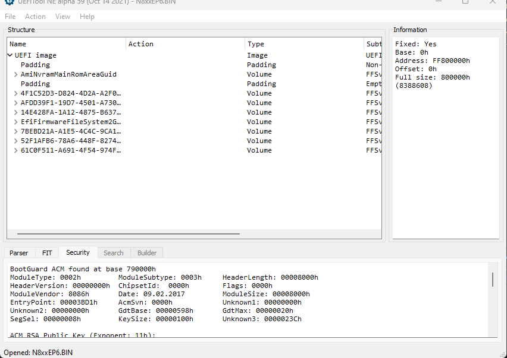
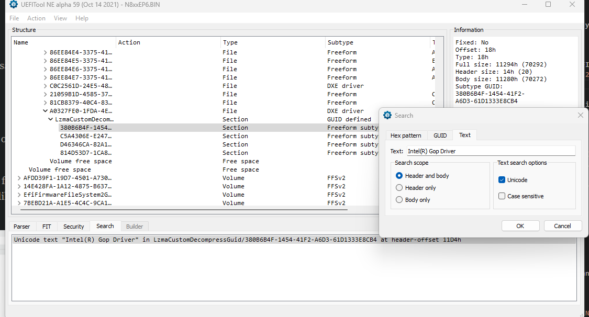

+++
title = 'Intel iGPU Passthrough for OVMF'
date = 2023-10-11T01:54:10Z

+++


# Why passthrough an Integrated GPU? 

Why pass an iGPU to a VM ? Because i wanted to , duh... 

Well in my particular case, i wanted to use the integrated Display/Laptop Displays the outputs for my VM and because i wanted to use all the available screen real estate possible ,while running a headless hypervisor underneath -Proxmox in this case.


# Prerequisites

This guide is mostly for Proxmox users and assumes that you have the following other requirements as well:

- Intel iGPUs on CPUs from Haswell to CometLake should work this (i've tested with Haswell,Broadwell).
- Proxmox 7.X (I assume Proxmox 8.X should work ,but i have not tested it myself).
- Access to your UEFI firmware blobs/updates .
- For the guest operating systems, i've tested Windows 10 and Windows 11.
- A linux environment with Podman where you can compile a OVMF image.

# Guide

There will be two parts to the guide, the first is preparing the necessary files ,then compiling your own version of OVMF with the Intel GOP (Graphics Output Protocol) driver and VBT (Video BIOS Tables) files. 

The second part describes setting up Proxmox and the virtual machine configuration files and setting intel iGPU direct passthrough or GVT-D

## vBios ROM override

### Q35 virtual machines
For q35 virtual machines download the following vBIOS rom override https://github.com/patmagauran/i915ovmfPkg/releases/tag/V0.2.1. 

I have also had success compiling it myself and will link my compiled here if you want to skip the hassle of doing it: [i915ovmf.rom](i915ovmf.rom). 

Otherwise feel free to compile it yourself from the repository linked, i will not discuss this in the guide as it is not that critical.
 
### i440fx virtual machines
For i440fx virtual machines ,download the following file from : [vbios_gvt_uefi.rom](https://web.archive.org/web/20201020144354/http://120.25.59.132:3000/vbios_gvt_uefi.rom) 

## Extract files and compile OVMF

You can either choose to extract the files yourself from the BIOS files 

**OR**
 
You can download **``"IntelGopDriver.efi"``** and **``"Vbt.bin"``** based on the architecture of your CPU it from here: https://winraid.level1techs.com/t/efi-lan-bios-intel-gopdriver-modules/33948/2

If you download it, you can skip the extraction steps and proceed to compiling your custom OVMF files. 

### Extracting IntelGopDriver.efi and Vbt.bin from your bios:

Download this tool as we are going to need this to extract the necessary files from here: https://github.com/LongSoft/UEFITool


Then download your BIOS/Firmware update files from your motherboard/OEM manufacturer. Quite often these are installer setups that can be extracted or zip file that contain a .efi or .bin file or named something else.

After scouring the interwebs, i found some BIOS/Firmware update files for my Clevo NP850EP6  and here's what a valid file i choose looks like for example.




With those .efi/.bin files in mind , you can search for the following with UEFITool

#### IntelGopDriver.efi:

If the GUID was not identified by UEFITools, open with the search by pressing Ctrl+F and try unicode text searching  "**``Intel(R) Gop Driver``**", or hex searching **``4900 6e00 7400 6500 6c00 2800 5200 2900 2000 4700 4f00 5000 2000 4400 7200 6900 7600 6500 7200``**  as shown below


Once you have identified it, right click on it and click on **'Extract body'**  as shown below 


And name it IntelGopDriver.efi, keep this file handy.

#### Vbt.bin:
Similar to IntelGopDriver.efi perform the above steps to search for and extract  **``Vbt.bin``**.

Some pointers to search for it is to try non unicode text searching **``$VBT``**, or hex searching **``2456 4254``** the file is usually began with non unicode **``$VBT <codename>``**, such as **``$VBT SKYLAKE``**


Once you have identified it, right click on it and click on **'Extract body'** and name it **``"Vbt.bin"``**

#### Compile custom OVMF with Intel GOP/VBT

Once we have the **``"IntelGopDriver.efi"``** and **``"Vbt.bin"``** files extracted ,copy them to a Linux environment of your choice that has **Podman** installed, it will be needed for the next step for compiling your own OVMF EFI image.

Once you have Podman ready ,go ahead and clone the **kethen/edk2-build-intel-gop** repo.

```
git clone https://github.com/Kethen/edk2-build-intel-gop

```

Copy the **``"IntelGopDriver.efi"``** and **``"Vbt.bin"``** files into newly created folder named **``gop``** in the cloned repo directory and then build the image
```
cd edk2-build-intel-gop
mkdir gop
cp <intel gop driver efi> gop/IntelGopDriver.efi
cp <intel gop vbt> gop/Vbt.bin
```

Build the image with the following command
```
bash build_ovmf.sh
```

The built OVMF files can be found in **``edk2/Build/OvmfX64/DEBUG_GCC5/FV/``** directory,the files you are searching for are **``OVMF_CODE.fd``** and **``OVMF_VAR.fd``**. Copy these files to your Proxmox host.

### Enabling IOMMU in Linux and Blacklisting PCI and Kernel modules

Get the PCI Vendor/Device ids to be blacklisted with ``lspci``. Usually in my experience Intel iGPUs are always located at ``00:02.0``
```
lspci -n -s 00:02.0
```
For example 
> ``00:02.0 0300: 8086:3e9b``

**``8086:3e9b``** is the PCI id that we need and then we add to the cmdline in the following steps


Edit the kernel cmdline at:
```
vim /etc/default/grub
```
Edit the following line: **``GRUB_CMDLINE_LINUX_DEFAULT=``** and add the following arguments 

```
GRUB_CMDLINE_LINUX_DEFAULT="quiet intel_iommu=on iommu=pt initcall_blacklist=sysfb_init vfio-pci.ids=8086:3e9b modprobe.blacklist=i915 modprobe.blacklist=snd_hda_codec_hdmi modprobe.blacklist=snd_hda_intel"
```

An explanation for the arguments for kernel cmd line :

**``intel_iommu=on``** enable IOMMU for Intel chipsets.

**``intel_iommu=pt``** enables turns on IOMMU tagging only for devices configured for pass through, allowing the host to ignore it for local host-only devices (hereby improving performance in certain cases).

**``initcall_blacklist=sysfb_init``**  stops the sysfb framebuffer from loading on the iGPU and free up the iGPU for a clean passthrough.

**``vfio-pci.ids=8086:3e9b``**  specifying the PCI IDs of a device to be bound to the VFIO driver,in this case our iGPU.

**``modprobe.blacklist=i915 modprobe.blacklist=snd_hda_codec_hdmi modprobe.blacklist=snd_hda_intel``**  these all blacklist prevent these kernel modules from loading and making sure the iGPU is not bound.

**NOTE**: This means that you will not have console access to your machine.


And then apply the changes to the GRUB configuration with the following commandline.
```
update-grub
```

### Enable VFIO kernel modules
Add these lines to enable the VFIO modules at  **``/etc/modules``**
```
vfio
vfio_iommu_type1
vfio_pci
vfio_virqfd
```

### Enable I/O interrupt remapping and ignore MSRs

Run the following the commands to enable allow I/O interrupt remapping and ignore MSRs

```
echo "options vfio_iommu_type1 allow_unsafe_interrupts=1" > /etc/modprobe.d/iommu_unsafe_interrupts.conf
echo "options kvm ignore_msrs=1" > /etc/modprobe.d/kvm.conf
```


### Update initramfs and reboot

And finally apply all the above changes by updating the initramfs and rebooting for the changes to take effect
```
update-initramfs -u
```

## Proxmox Virtual machine configuration


### For Q35 virtual machines


Assuming you have moved the **``i915ovmf.rom``** to **``/usr/share/kvm``**  Then **``OVMF_CODE.fd``** and **``OVMF_VAR.fd``** to a folder at **``/root/OVMF``**

Set your BIOS type in your Proxmox VM configuration to be SeaBIOS in order to prevent a conflict with custom arguments we set below 

And then set your display type to none in your Proxmox VM configuration as well.


Add the following lines to your Proxmox VM configuration located at **``/etc/pve/qemu-server/<VMID.conf>``** where VMID is the VM id of your Proxmox virtual machine

```
args: -device vfio-pci,host=00:02.0,bus=pci.0,addr=0x2,x-igd-opregion=on,x-igd-gms=1,romfile=i915ovmf.rom  -drive 'if=pflash,unit=0,format=raw,readonly,file=/root/OVMF/OVMF_CODE.fd' -drive 'if=pflash,unit=1,format=raw,id=drive-efidisk0,file=/root/bios/OVMF/OVMF_VARS.fd'
```


This is what  a sample Proxmox configuration could look like
```
args: -device vfio-pci,host=00:02.0,bus=pci.0,addr=0x2,x-igd-opregion=on,x-igd-gms=1,romfile=i915ovmf.rom  -drive 'if=pflash,unit=0,format=raw,readonly,file=/root/bios/OVMFintelGOP/OVMF_CODE.fd' -drive 'if=pflash,unit=1,format=raw,id=drive-efidisk0,file=/root/bios/OVMFintelGOP/OVMF_VARS.fd' 
balloon: 0
bios: seabios
boot: order=virtio0;net0
cores: 4
cpu: host
localtime: 0
machine: pc-q35-7.2
memory: 8192
name: q35-iGPU
net0: virtio=8E:A6:82:97:9C:C1,bridge=vmbr0
numa: 0
ostype: win11
scsihw: virtio-scsi-single
sockets: 1
tablet: 0
vga: none
virtio0: cephrbd-aus:vm-109-disk-0,cache=unsafe,iothread=1,size=32G

```

### For i440fx virtual machines


Assuming you have moved the **``vbios_gvt_uefi.rom``** to **``/usr/share/kvm``**  Then from the custom compiled OVMF ,the files **``OVMF_CODE.fd``** and **``OVMF_VAR.fd``** to a folder at **``/root/OVMF``**

Add the following lines to your Proxmox VM configuration located at **``/etc/pve/qemu-server/<VMID.conf>``** where VMID is the VM id of your Proxmox virtual machine


```
args: -device vfio-pci,host=00:02.0,bus=pci.0,addr=0x2,x-igd-opregion=on,x-igd-gms=1,romfile=vbios_gvt_uefi.rom -drive 'if=pflash,unit=0,format=raw,readonly,file=/root/bios/OVMFintelGOP/OVMF_CODE.fd' -drive 'if=pflash,unit=1,format=raw,id=drive-efidisk0,file=/root/bios/OVMFintelGOP/OVMF_VARS.fd' 
```
This is what  a sample Proxmox configuration could look like


```
args: -device vfio-pci,host=00:02.0,bus=pci.0,addr=0x2,x-igd-opregion=on,x-igd-gms=1,romfile=vbios_gvt_uefi.rom -drive 'if=pflash,unit=0,format=raw,readonly,file=/root/bios/OVMFintelGOP/OVMF_CODE.fd' -drive 'if=pflash,unit=1,format=raw,id=drive-efidisk0,file=/root/bios/OVMFintelGOP/OVMF_VARS.fd' 
balloon: 0
bios: seabios
boot: order=virtio0;ide2
cores: 4
cpu: host
ide2: none,media=cdrom
localtime: 0
machine: pc-i440fx-7.2
memory: 2048
meta: creation-qemu=7.2.0,ctime=1689492646
name: i440fx-iGPU
net0: virtio=36:26:74:C2:9A:72,bridge=vmbr0,firewall=1
numa: 0
ostype: win11
scsihw: virtio-scsi-single
sockets: 1
tablet: 0
vga: none
virtio0: local-lvm:vm-120-disk-0,cache=unsafe,iothread=1,size=32G
```
### Additional step for i440fx virtual machines 

Edit /usr/share/perl5/PVE/QemuServer.pm  and add this line

``` 
$bridges->{2} = 1 if $vmid != [VMID ]; 

```

Where VMID is the VMID of your virtual machine ,so for example my VMID of iGPU virtual machine is 140.

You will the find the block at line 4130 and here is an example modification

```
    if (!$q35) {
        # add pci bridges
        if (min_version($machine_version, 2, 3)) {
           $bridges->{1} = 1;
           #$bridges->{2} = 1;  disabled
           $bridges->{2} = 1 if $vmid != 140;       #Legacy IGD passthrough fix
        }

        $bridges->{3} = 1 if $scsihw =~ m/^virtio-scsi-single/;

    }
```


Now just refresh the change by running the following
```
pvedaemon restart
```


### Explanation of the QEMU arguments used


A little explanation for QEMU arguments 


- `-device vfio-pci,host=00:02.0,bus=pci.0,addr=0x2` Passthrough the iGPU at PCI address 00:2.0 on PCI Bus 0 at Device 2 (just matching what a physical machine sees  )
- `x-igd-opregion=on` It exposes opregion (VBT included) to guest driver so that the guest driver could parse display connector information from. This property is mandatory for the Windows VM to enable display output.
- `x-igd-gms=1` This argument specifies sets a value multiplied by 32 as the amount of pre-allocated memory (in units of MB) to support IGD in VGA modes
- `romfile=i915ovmf.rom` Specifies a ROM file for the device, in this case we are using the i915ovmf.rom or vbios_gvt_uefi.rom that we accquired earlier.

- `-drive 'if=pflash,unit=0,format ..... F/OVMF_VARS.fd' `  This argument is how we passthrough the custom compiled OVMF image that we compiled ourselves for iGPU passthrough 

## Configuration complete

That's about the configuration you should need for iGPU passthrough in Proxmox.


When you boot your machine ,you should be greeted with the Tiano-core boot screen if you followed all the steps and everything worked out alright.

Feel free to install intel drivers once you have working passthrough.

I've had success with Haswell,Broadwell,Skylake,Coffeelake iGPUs

### Other notes
Broadwell also has issues with kernels newer than 5.3 ,so downgrade the kernel.You’ll see `Disabling IOMMU for graphics on this chipset` in the dmesg, and the integrated GPU will not be visible for passthrough.

[https://github.com/torvalds/linux/commit/1f76249cc3bebd6642cb641a22fc2f302707bfbb](https://github.com/torvalds/linux/commit/1f76249cc3bebd6642cb641a22fc2f302707bfbb)

### Misc Libvirt config

Here is a sample libvirt config provided by _shadow1_x

```
<domain xmlns:qemu="http://libvirt.org/schemas/domain/qemu/1.0" type="kvm">
  <name>name</name>
  <uuid>637b8ef3-14f9-4096-bb85-dfae62089c4f</uuid>
  <metadata>
    <libosinfo:libosinfo xmlns:libosinfo="http://libosinfo.org/xmlns/libvirt/domain/1.0">
      <libosinfo:os id="http://microsoft.com/win/11"/>
    </libosinfo:libosinfo>
  </metadata>
  <memory unit="KiB">15360000</memory>
  <currentMemory unit="KiB">15360000</currentMemory>
  <vcpu placement="static">8</vcpu>
  <iothreads>1</iothreads>
  <cputune>
    <vcpupin vcpu="0" cpuset="0"/>
    <vcpupin vcpu="1" cpuset="1"/>
    <vcpupin vcpu="2" cpuset="2"/>
    <vcpupin vcpu="3" cpuset="3"/>
    <vcpupin vcpu="4" cpuset="4"/>
    <vcpupin vcpu="5" cpuset="5"/>
    <vcpupin vcpu="6" cpuset="6"/>
    <vcpupin vcpu="7" cpuset="7"/>
    <emulatorpin cpuset="0,4"/>
    <iothreadpin iothread="1" cpuset="0,4"/>
  </cputune>
  <os>
    <type arch="x86_64" machine="pc-q35-6.2">hvm</type>
    <loader readonly="yes" type="pflash">/home/user/VM/ovmf-pleasework/winoptimus/OVMF_CODE.fd</loader>
    <nvram>home/user/VM/ovmf-pleasework/winoptimus/OVMF_VARS.fd</nvram>
    <boot dev="hd"/>
    <bootmenu enable="yes"/>
  </os>
  <features>
    <acpi/>
    <apic/>
    <hyperv mode="custom">
      <relaxed state="on"/>
      <vapic state="on"/>
      <spinlocks state="on" retries="8191"/>
      <vpindex state="on"/>
      <runtime state="on"/>
      <synic state="on"/>
      <stimer state="on"/>
      <reset state="off"/>
      <vendor_id state="on" value="whatever"/>
      <frequencies state="on"/>
      <reenlightenment state="off"/>
      <tlbflush state="on"/>
      <ipi state="on"/>
      <evmcs state="off"/>
    </hyperv>
    <kvm>
      <hidden state="off"/>
    </kvm>
    <ioapic driver="kvm"/>
  </features>
  <cpu mode="host-passthrough" check="none" migratable="on">
    <topology sockets="1" dies="1" cores="4" threads="2"/>
    <cache mode="passthrough"/>
    <feature policy="require" name="topoext"/>
  </cpu>
  <clock offset="localtime">
    <timer name="rtc" tickpolicy="catchup"/>
    <timer name="pit" tickpolicy="delay"/>
    <timer name="hpet" present="no"/>
    <timer name="hypervclock" present="yes"/>
    <timer name="tsc" present="yes" mode="native"/>
  </clock>
  <on_poweroff>destroy</on_poweroff>
  <on_reboot>restart</on_reboot>
  <on_crash>destroy</on_crash>
  <pm>
    <suspend-to-mem enabled="no"/>
    <suspend-to-disk enabled="no"/>
  </pm>
  <devices>
    <emulator>/usr/bin/qemu-system-x86_64</emulator>
    <disk type="file" device="disk">
      <driver name="qemu" type="qcow2"/>
      <source file="/var/lib/libvirt/images/arch.qcow2"/>
      <target dev="vda" bus="virtio"/>
      <address type="pci" domain="0x0000" bus="0x04" slot="0x00" function="0x0"/>
    </disk>
    <disk type="file" device="disk">
      <driver name="qemu" type="raw"/>
      <source file="/var/lib/libvirt/images/windows.img"/>
      <target dev="vdb" bus="virtio"/>
      <address type="pci" domain="0x0000" bus="0x05" slot="0x00" function="0x0"/>
    </disk>
    <disk type="file" device="cdrom">
      <driver name="qemu" type="raw"/>
      <source file="/home/user/Downloads/archlinux-2023.08.01-x86_64.iso"/>
      <target dev="sda" bus="sata"/>
      <readonly/>
      <address type="drive" controller="0" bus="0" target="0" unit="0"/>
    </disk>
    <controller type="usb" index="0" model="qemu-xhci" ports="15">
      <address type="pci" domain="0x0000" bus="0x03" slot="0x00" function="0x0"/>
    </controller>
    <controller type="sata" index="0">
      <address type="pci" domain="0x0000" bus="0x00" slot="0x1f" function="0x2"/>
    </controller>
    <controller type="pci" index="0" model="pcie-root"/>
    <controller type="pci" index="1" model="pcie-root-port">
      <model name="pcie-root-port"/>
      <target chassis="1" port="0x8"/>
      <address type="pci" domain="0x0000" bus="0x00" slot="0x01" function="0x0" multifunction="on"/>
    </controller>
    <controller type="pci" index="2" model="pcie-root-port">
      <model name="pcie-root-port"/>
      <target chassis="2" port="0x9"/>
      <address type="pci" domain="0x0000" bus="0x00" slot="0x01" function="0x1"/>
    </controller>
    <controller type="pci" index="3" model="pcie-root-port">
      <model name="pcie-root-port"/>
      <target chassis="3" port="0xa"/>
      <address type="pci" domain="0x0000" bus="0x00" slot="0x01" function="0x2"/>
    </controller>
    <controller type="pci" index="4" model="pcie-root-port">
      <model name="pcie-root-port"/>
      <target chassis="4" port="0xb"/>
      <address type="pci" domain="0x0000" bus="0x00" slot="0x01" function="0x3"/>
    </controller>
    <controller type="pci" index="5" model="pcie-root-port">
      <model name="pcie-root-port"/>
      <target chassis="5" port="0xc"/>
      <address type="pci" domain="0x0000" bus="0x00" slot="0x01" function="0x4"/>
    </controller>
    <controller type="pci" index="6" model="pcie-root-port">
      <model name="pcie-root-port"/>
      <target chassis="6" port="0xd"/>
      <address type="pci" domain="0x0000" bus="0x00" slot="0x01" function="0x5"/>
    </controller>
    <controller type="pci" index="7" model="pcie-root-port">
      <model name="pcie-root-port"/>
      <target chassis="7" port="0xe"/>
      <address type="pci" domain="0x0000" bus="0x00" slot="0x01" function="0x6"/>
    </controller>
    <controller type="pci" index="8" model="pcie-root-port">
      <model name="pcie-root-port"/>
      <target chassis="8" port="0xf"/>
      <address type="pci" domain="0x0000" bus="0x00" slot="0x01" function="0x7"/>
    </controller>
    <controller type="pci" index="9" model="pcie-to-pci-bridge">
      <model name="pcie-pci-bridge"/>
      <address type="pci" domain="0x0000" bus="0x07" slot="0x00" function="0x0"/>
    </controller>
    <interface type="network">
      <mac address="52:54:00:a8:ae:39"/>
      <source network="networkhostonly"/>
      <model type="virtio"/>
      <address type="pci" domain="0x0000" bus="0x06" slot="0x00" function="0x0"/>
    </interface>
    <input type="mouse" bus="ps2"/>
    <input type="keyboard" bus="ps2"/>
    <graphics type="spice" port="-1" autoport="no">
      <listen type="address"/>
      <image compression="off"/>
      <gl enable="no"/>
    </graphics>
    <audio id="1" type="spice"/>
    <video>
      <model type="none"/>
    </video>
    <hostdev mode="subsystem" type="pci" managed="yes">
      <source>
        <address domain="0x0000" bus="0x01" slot="0x00" function="0x0"/>
      </source>
      <rom bar="on"/>
      <address type="pci" domain="0x0000" bus="0x01" slot="0x00" function="0x0" multifunction="on"/>
    </hostdev>
    <hostdev mode="subsystem" type="pci" managed="yes">
      <source>
        <address domain="0x0000" bus="0x01" slot="0x00" function="0x1"/>
      </source>
      <rom bar="on"/>
      <address type="pci" domain="0x0000" bus="0x01" slot="0x00" function="0x1"/>
    </hostdev>
    <hostdev mode="subsystem" type="pci" managed="yes">
      <source>
        <address domain="0x0000" bus="0x00" slot="0x02" function="0x0"/>
      </source>
      <rom file="/home/user/VM/working-efi/i915ovmfDMVT.rom"/>
      <address type="pci" domain="0x0000" bus="0x00" slot="0x02" function="0x0"/>
    </hostdev>
    <hostdev mode="subsystem" type="pci" managed="yes">
      <source>
        <address domain="0x0000" bus="0x00" slot="0x14" function="0x0"/>
      </source>
      <address type="pci" domain="0x0000" bus="0x09" slot="0x02" function="0x0"/>
    </hostdev>
    <hostdev mode="subsystem" type="pci" managed="yes">
      <source>
        <address domain="0x0000" bus="0x00" slot="0x1f" function="0x3"/>
      </source>
      <address type="pci" domain="0x0000" bus="0x09" slot="0x01" function="0x0"/>
    </hostdev>
    <hostdev mode="subsystem" type="pci" managed="yes">
      <source>
        <address domain="0x0000" bus="0x00" slot="0x17" function="0x0"/>
      </source>
      <address type="pci" domain="0x0000" bus="0x09" slot="0x03" function="0x0"/>
    </hostdev>
    <hostdev mode="subsystem" type="pci" managed="yes">
      <source>
        <address domain="0x0000" bus="0x04" slot="0x00" function="0x0"/>
      </source>
      <address type="pci" domain="0x0000" bus="0x02" slot="0x00" function="0x0"/>
    </hostdev>
    <memballoon model="none"/>
  </devices>
  <qemu:commandline>
    <qemu:arg value="-fw_cfg"/>
    <qemu:arg value="name=etc/igd-bdsm-size,file=/home/user/VM/ovmf-pleasework/i915OVMF/bdsmSize.bin"/>
    <qemu:arg value="-fw_cfg"/>
    <qemu:arg value="name=etc/igd-opregion,file=/home/user/VM/ovmf-pleasework/i915OVMF/opregion.bin"/>
    <qemu:arg value="-object"/>
    <qemu:arg value="input-linux,id=keyb1,evdev=/dev/input/event3"/>
  </qemu:commandline>
  <qemu:override>
    <qemu:device alias="hostdev0">
      <qemu:frontend>
        <qemu:property name="x-pci-sub-vendor-id" type="unsigned" value="4156"/>
        <qemu:property name="x-pci-sub-device-id" type="unsigned" value="33679"/>
      </qemu:frontend>
    </qemu:device>
    <qemu:device alias="hostdev2">
      <qemu:frontend>
        <qemu:property name="x-vga" type="bool" value="true"/>
        <qemu:property name="driver" type="string" value="vfio-pci-nohotplug"/>
      </qemu:frontend>
    </qemu:device>
  </qemu:override>
</domain>
```

## References and credits

_shadow1_x from the VFIO Discord for helping me getting the q35 virtual machine working and his sample Libvirt configuration

https://github.com/Kethen/edk2-build-intel-gop

https://github.com/patmagauran/i915ovmfPkg/wiki

https://forum.proxmox.com/threads/igd-passthrough-and-hard-coded-pci-bridges.68285/


https://wiki.archlinux.org/title/Intel_GVT-g

https://eci.intel.com/docs/3.0/components/kvm-hypervisor.html
